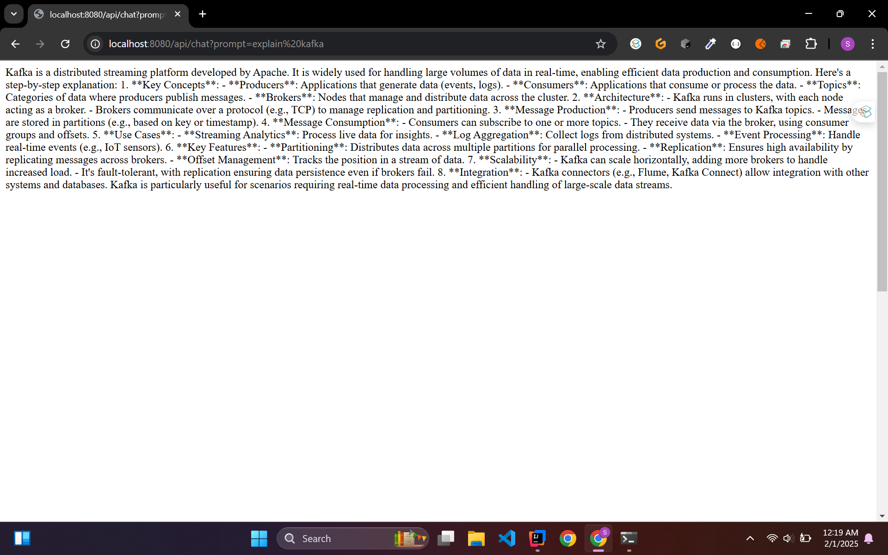

# DeepseekChatSpringBoot

## Overview
This App will send the prompt and query Ollama Deepseek-r1:8b and return the response
---

## Table of Contents

1. [Step 1: Preparation](#step-1-preparation)
2. [Step 2: Setup](#step-2-setup)
3. [Step 3: Execution](#step-3-execution)
4. [Step 4: Finalization](#step-4-finalization)

---

## Step 1: Preparation

### Subheading 1.1: Gather Required Tools
Before beginning, make sure you have the following items ready:
- Ollama (you can download and install this from https://ollama.com/download)
- Deepseek-r1:8b (Once Ollama is installed, you can run "ollama run deepseek-r1:8b" command in the terminal to run the model)

---

## Step 2: Setup

###
Setup your springboot project in your favourite ide and add the following dependencies:
- Spring AI (Ollama)
- Spring Web

### Configure Properties
Add the following property to the application.properties:

spring.ai.ollama.chat.model=deepseek-r1:8b

## Step 3: Execution

### Run the Springboot App
Now that your model is running, run the Springboot app in your favourite ide
and hit the api.

## Step 4: Output

## Conclusion
Congratulations! You've successfully completed the process. You can now [next steps, e.g., use the results, share your work, etc.]. If you run into any issues, feel free to consult the troubleshooting section or contact support.

### Additional Information

You can use any model provided in the Spring AI and provide access key and access apis through the Springboot app.

---

